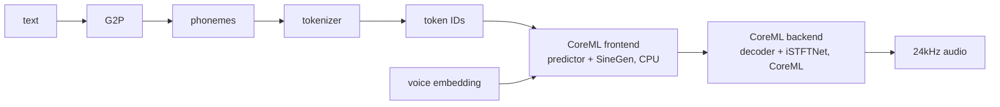

<p align="center">
  
</p>

<h1 align="center">kokoro-coreml</h1>

<p align="center">give your agent a voice.</p>

<p align="center">
  on-device text-to-speech for Swift. 54 voices. CoreML on Apple Silicon. no cloud. no MLX.
</p>

---

**6-16x faster than real-time** on M-series. handles any length text -- automatic chunking, streaming, voice selection, speed control. Kokoro-82M via CoreML on Apple Silicon. ~99MB model download.

## install

### homebrew

```bash
brew install jud/kokoro-coreml/kokoro
```

### swift package manager

```swift
dependencies: [
    .package(url: "https://github.com/Jud/kokoro-coreml.git", from: "0.8.0"),
]
```

models (~99MB) download automatically on first use.

### multilingual (optional, GPL-3.0)

for French, Spanish, Italian, Portuguese, Hindi, and other languages via eSpeak-NG:

```bash
swift build --traits espeak
```

this enables `--language` in the CLI and `EspeakPhonemizer` in the library API. default builds remain Apache 2.0.

## three lines to speech

```swift
import KokoroCoreML

let engine = try KokoroEngine()
for await event in try engine.speak("hello from the other side", voice: "af_heart") {
    player.play(event)
}
```

async streaming. audio chunks arrive as they're synthesized. playback starts immediately.

## usage

### synthesize

```swift
let engine = try KokoroEngine()
let result = try engine.synthesize(text: "hello world", voice: "af_heart")
// result.samples → 24kHz mono PCM float array
// result.duration → audio length in seconds
// result.realTimeFactor → how much faster than real-time
```

### streaming

for long text, `speak()` streams audio chunks via `AsyncStream<SpeakEvent>`:

```swift
for await event in try engine.speak("any length text...", voice: "af_heart") {
    switch event {
    case .audio(let buffer): player.scheduleBuffer(buffer)
    case .chunkFailed(let error): print("chunk failed: \(error)")
    }
}
```

no manual chunking. no PCM conversion. text goes in, playback-ready audio comes out.

### speed control

```swift
try engine.synthesize(text: "take your time", voice: "af_heart", speed: 0.7)
try engine.synthesize(text: "let's go", voice: "af_heart", speed: 1.5)
```

0.5x to 2.0x. one parameter.

### IPA input

skip the G2P pipeline entirely:

```swift
let result = try engine.synthesize(ipa: "hˈɛloʊ wˈɜːld", voice: "af_heart")
```

### multilingual (with eSpeak)

```swift
let phonemizer = try EspeakPhonemizer()
let result = try engine.synthesize(
    text: "bonjour le monde", voice: "ff_siwis",
    phonemizer: phonemizer, language: "fr")
```

requires `--traits espeak` build flag. supports French, Spanish, Italian, Portuguese, Hindi, and more.

## the command line

```bash
kokoro say "hello from the terminal"
kokoro say -v am_adam -s 1.3 "speed it up"
kokoro say --stream "start hearing audio before synthesis finishes"
kokoro say -o output.wav "save to file"
echo "long article" | kokoro say --stream
kokoro say --list-voices
kokoro daemon start   # keep models loaded, 3x faster repeat synthesis
```

`--stream` starts playback as soon as the first chunk is ready. `--ipa` accepts IPA phonemes directly.

with eSpeak enabled: `kokoro say --language fr -v ff_siwis "bonjour le monde"`

## performance

| metric | value |
|--------|-------|
| real-time factor | 6-16x faster than real-time |
| inference | ~100ms per chunk via CoreML |
| sample rate | 24kHz mono PCM |
| voices | 54 distinct voices and accents |
| speed control | 0.5x - 2.0x |
| model download | ~99MB (8-bit palettized + binary voices) |

## how it works



text goes through an english G2P pipeline -- lexicon lookup, morphological stemming, number expansion. unknown words hit a fallback chain: CamelCase splitting, BART neural G2P, letter spelling as last resort. optional eSpeak-NG phonemizer adds multilingual support.

the engine uses a single dynamic CoreML model pair with 8-bit palettized weights. any length text gets chunked at sentence boundaries. `synthesize()` returns the full result. `speak()` streams chunks as `AsyncStream<SpeakEvent>`.

## architecture

```mermaid
graph TD
    subgraph "text pipeline"
        T1[text] --> T2[paragraph split]
        T2 --> T3[G2P phonemization]
        T3 --> T4[punctuation-aware chunking]
        T4 --> T5[tokenization]
    end

    subgraph "inference"
        T5 --> I1[dynamic CoreML models]
        V[voice store] --> I1
        I1 --> I2[frontend: predictor + SineGen<br/>CPU]
        I2 --> I3[backend: decoder + iSTFTNet<br/>GPU]
        I3 --> I4[PCM samples]
    end

    subgraph "output"
        I4 -->|synthesize| O1[full audio array]
        I4 -->|speak| O2[AsyncStream&lt;SpeakEvent&gt;]
    end
```



## model

- **architecture**: Kokoro-82M -- StyleTTS2 encoder + iSTFTNet vocoder
- **weights**: 8-bit palettized (75% smaller than float32, perceptually identical)
- **runtime**: CoreML -- frontend on CPU, backend on GPU via Apple Silicon
- **sample rate**: 24kHz mono
- **voices**: 54 style embeddings across american, british, and international accents
- **platform**: macOS 15+, iOS 18+

## license

Apache 2.0

eSpeak-NG phonemizer (optional, behind `--traits espeak`) is GPL-3.0. default builds do not include it.
